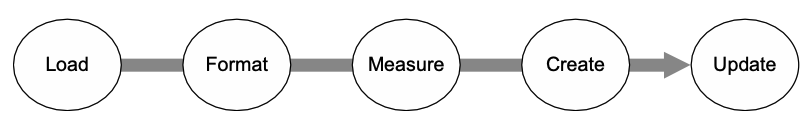

import Image from '@site/src/components/Image';
import ReactPlayer from 'react-player';

LinkGraph는 두가지 목적을 가지고 있다.

1. 사람과 연결된 링크를 **그래프 형태**로 표현한다.
2. 사람들과의 관계를 **그래프 형태**로 표현한다.

이 두가지 목적에는 모두 그래프가 필요하다. 사람과 연결된 링크를 Node와 Edge로 나타내고 이를 연결해야한다.
D3는 Node와 Edge를 표현할 수 있었고 웹에서 데이터를 시각화하는데 표준처럼 사용되고 있었기 때문에 D3를 사용하기로 선택했다.

나는 내가 원하는 그래프 형태를 빠르게 만들어보고 검증할 필요가 있었다. 하지만 생각보다 레퍼런스가 많지 않았고
[**D3.js in Action**](https://product.kyobobook.co.kr/detail/S000001057709)이라는 책을 조금씩 공부했다.

D3는 Data Driven Documents의 약자이다. 결국 DOM에 데이터를 표현하는게 목적이기 때문에 D3는 아래와 같은 문장으로 표현가능하다.

> **D3 is about selecting and binding.**  
> **D3 is about deriving the appearance of web page elements from bound data.**



결국 API를 통해 불러온 데이터를 가공한 후 DOM에 표현하고 데이터가 변경될 때 변경된 내용을 업데이트하는 것이 D3의 역할이다.

이제 큰 그림을 그려봤으니 React에서 어떻게 사용하는지 알아보자.

## D3 in React

D3는 DOM을 직접 조작하기 때문에 React와 같이 사용할 때는 `useRef`를 사용해야 한다.
useEffect 내부에서 d3를 통해 svg 요소를 선택하고 어떤 것을 그릴지 메서드 체이닝 형태로 전달해주는 패턴이다.

```tsx
'use client';
import { NextPage } from 'next';
import { useEffect, useRef } from 'react';
import * as d3 from 'd3';

const Test: NextPage = () => {
  const svgRef = useRef<SVGSVGElement>(null);

  useEffect(() => {
    d3.select('svg')
      .append('line')
      .attr('x1', 20)
      .attr('y1', 20)
      .attr('x2', 400)
      .attr('y2', 400)
      .style('stroke', 'black')
      .style('stroke-width', 2);

    d3.select('svg').append('circle').attr('r', 20).attr('cx', 20).attr('cy', 20).style('fill', 'red');
    d3.select('svg').append('text').attr('id', 'a').attr('x', 20).attr('y', 20).style('opacity', 0).text('Hello World');
    d3.select('svg').append('circle').attr('r', 100).attr('cx', 400).attr('cy', 400).style('fill', 'lightblue');
    d3.select('svg').append('text').attr('id', 'b').attr('x', 400).attr('y', 400).style('opacity', 0).text('Uh, hi.');

    d3.select('#a').transition().delay(1000).style('opacity', 1);
    d3.select('#b').transition().delay(2000).style('opacity', 0.75);

    d3.selectAll('circle').transition().duration(2000).attr('cy', 200);
  }, []);

  return (
    <>
      <svg ref={svgRef} className="bg-gray-200 w-[500px] h-[500px] border-1 border-black-200" />
    </>
  );
};

export default Test;
```

위 코드는 React 프로젝트에서 가장 기본적인 D3의 사용법이다. svg에 line이나 circle, text를 추가할 수 있으며 속성을 지정할 수 있다.
그리고 재밌는점은 transition을 주는 방법이 정말 쉽다는 것이다.

이전 상태를 먼저 정의해놓고 이후 상태를 정의할 때 transition()을 호출해주면 된다.

<ReactPlayer playing controls url="/video/d3-from-scratch.mp4" />

## Force Graph

Force Graph는 노드와 노드 사이의 연결을 표현할 수 있는 그래프이다.
사용법은 [d3-force Repo](https://github.com/d3/d3-force)를 보면 확인할 수 있다.

```tsx
'use client';
import { NextPage } from 'next';
import { useEffect, useRef } from 'react';
import * as d3 from 'd3';

const nodes = [{ id: 'Alice' }, { id: 'Bob' }, { id: 'Carol' }];

const links = [
  { source: 0, target: 1 }, // Alice → Bob
  { source: 1, target: 2 }, // Bob → Carol
];

const centerX = 960 / 2;
const centerY = 500 / 2;

const Graph: NextPage = () => {
  const svgRef = useRef<SVGSVGElement>(null);

  useEffect(() => {
    const simulation = d3
      .forceSimulation(nodes as any)
      .force('charge', d3.forceManyBody())
      .force('link', d3.forceLink(links))
      .force('center', d3.forceCenter(centerX, centerY));

    const svg = d3.select(svgRef.current);
    const circles = svg.selectAll('circle').data(nodes).enter().append('circle').attr('r', 10);
    const lines = svg.selectAll('line').data(links).enter().append('line').attr('stroke', 'black');

    simulation.on('tick', () => {
      circles.attr('cx', (node: any) => node.x);
      circles.attr('cy', (node: any) => node.y);

      lines
        .attr('x1', (link: any) => link.source.x)
        .attr('y1', (link: any) => link.source.y)
        .attr('x2', (link: any) => link.target.x)
        .attr('y2', (link: any) => link.target.y);
    });
  }, []);
  return (
    <>
      <svg ref={svgRef} className="w-[960px] h-[500px] bg-red-200" />
    </>
  );
};

export default Graph;
```

Node와 Link를 정의하고 forceSimulation을 통해 시뮬레이션을 만들어주면 된다.
이후 tick 이벤트에서 노드와 링크의 위치를 업데이트 해주면 그래프를 그릴 수 있다.


아직 D3에 대한 이해도가 많이 떨어지지만 이렇게 간단하게 그래프를 그릴 수 있다는 것이 신기하다.
